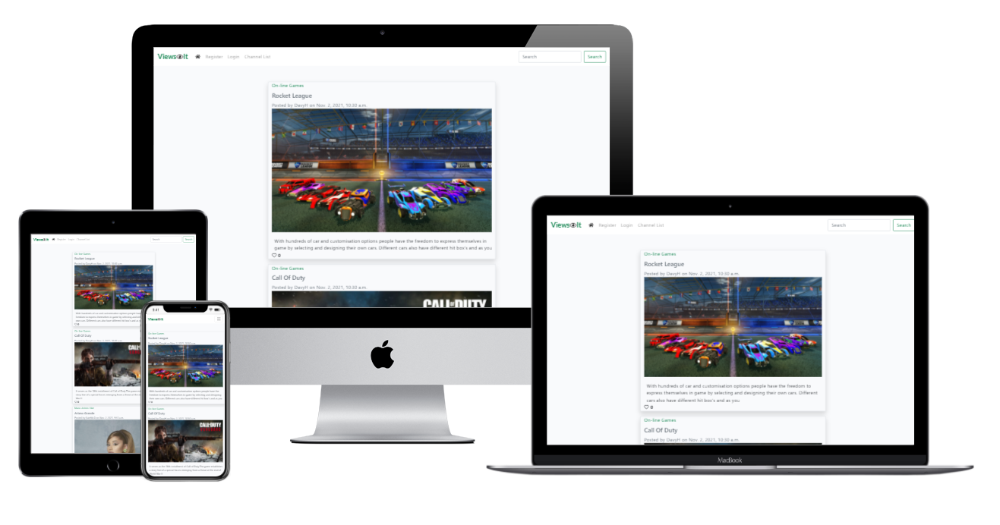
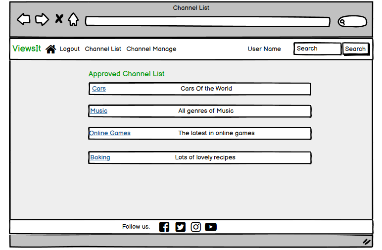
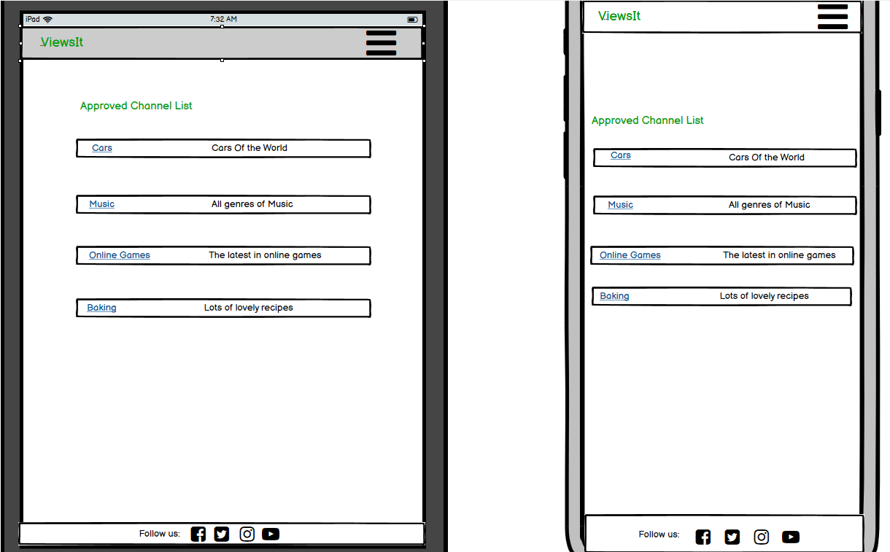
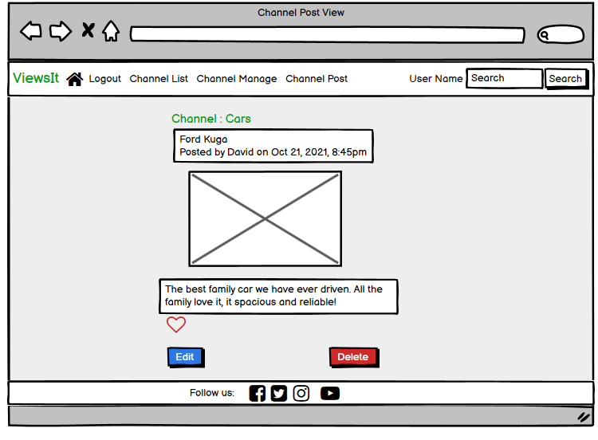
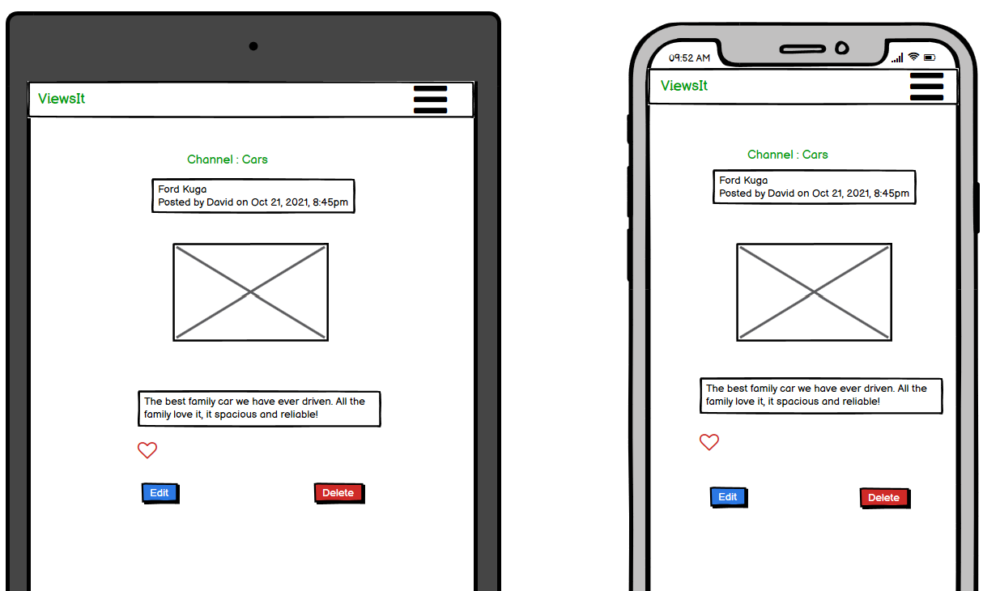
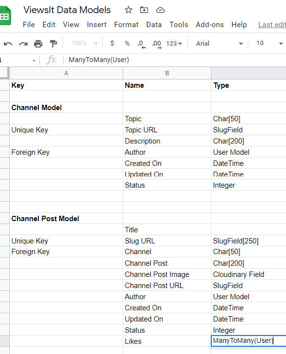
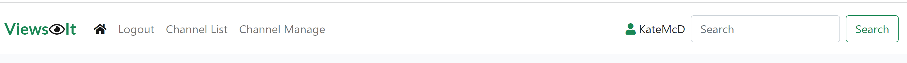
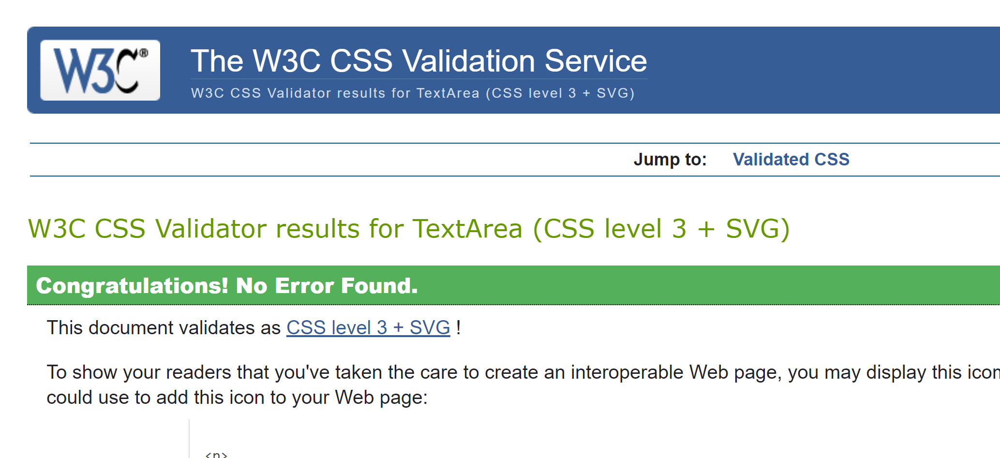
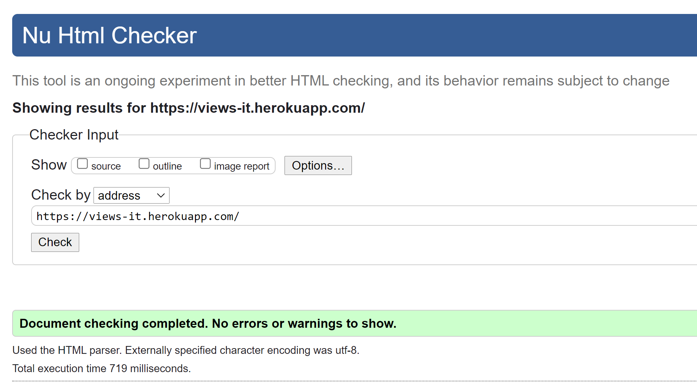

# ViewsIt Site

The ViewsIt site is a social website. There are three different type of users for the site, a super user or administrator, a visitor to the site who chooses not to create a profile on the site and a vistor to the site who creates a user profile so they can contribute to the site. A visitor to the site can view all of the posts and channels on the site. Users can create a new channel or create posts to their own channel or another users channel. Once a channel is created it has to be approved by the administrator before a post can be posted to it. A post has to be approved by the channel owner before it can be viewd by all visitors to the site.

## Multi Screen of the site
ViewsIt - https://views-it.herokuapp.com/

## Design of the site
### Wireframes
When designing the look and feel of the site I looked to Reddit and Facebook and tried to simulate some of the layout on these sites. 

### Data Models
There are two database models, the Channel model and the Channel Posts model. The Channel model will store all the details on the channel, the channel topic, description, author, date created, date updated and an approved field, status, which will be set to 0(draft) or 1(published). It will hold a unique key which is a prepopulated slug field, channel topic url.

The Channel Posts model will store all of the details on the post attached to a channel, the post title, post description, post image, post url/link for more information on the post, author, date created, updated date and an approve field. It will hold a unique key which is comprised of the post title and the current date/time. It also holds the channel topic and has on delete cascade so that when a channel is deleted by the channel author all of the posts attached to this chanel will also be deleted automatically.

## User Stories
* Site visitor to view list of approved channels.
* Site visitor to view posts in channels
* Site visitor to view stats for a channel, posts and likes.
* Site visitor to view stats for a post, see how many likes there are.
* Site visitor to use search for author, channel topic or post title.
* Account Registration for site vistor.
* Set up a new channel as a registered user of the site.
* As a super user/administrator add, edit and delete posts.
* As a registered user of the site add, edit and delete posts.
* As an owner of a channel th ability to approve channel posts.
* As a user to like/unlike posts and comments
* Ad a super user/ administrator the ability to approve a new channel
* Add an image to channel posts
* Add a url within a channel posts

## Features/Functions

## Existing Features

### Registration/Login Forms
* I created a new layout to the registration of a user to the site. I also created a new layout to the forms for the login and logout screens.

### Navigation Bar

* The navigation bar is located at the top of all pages on the site.
* The options available dynamically change depending on the type of viewer and depending on the specific menu path chosen.

### Home button
* Shows approved posts against all channels

### Channel List page

* Lists all approved channels so the user can view approved posts again a specific channel
* Visitors to the site (Unauthenticated login) can also view the approved channel list.

### Channel Manage page

* One stop place for all channel management activity.
* Activities that can be accessed via the Channel Management page are: Request New Channel, Delete a Channel, Edit a Channel, Un-approve Posts submitted by users, Approve posts submitted by users
* Only channels created by the current logged in users are accessible on the page
* If a logged in User requests a new channel, this will be visible on their page with a status of Draft and no other user will be able to see or post to the channel. The new channel request must be approved by the site Administrator before the Channel changes to status of Approved and it will then be possible for users to create posts under this channel.
* If the Channel Manager presses the Delete Channel button a modal confirmation dialog will be displayed. Deleting a channel also removes any posts created under the channel.
* The Channel Manager (person who creates the channel) can also edit the channel detail. Doing so will put the channel back into a status of Draft requiring site Administrator approval again, which means that any posts created under the channel will be hidden from users until the channel has been re-approved.
* The Channel Manager also has the option to Un-Approve posts created by users of the channel. This will link to the Posts page interface to allow this to happen (see below). The Posts page (when called from Channel Manage page) will only display posts with a status of Approved and only from the channel selected. 
* The Channel Manager has the option also to Approve posts created by users of the channel. The link in the Channel Manager display the amount of un-approved posts in the channel as a link. This will link to the Posts page interface to allow this to happen (see below). The Posts page (when called from Channel Manage page) will only display posts with a status of Draft and only from the channel selected.

### View Posts page
* Accessible via Home button or via Channel List page
* Shows all approved posts
* Will show all approved posts from all approved channels if invoked from the Home button. Will only show approved posts from a specific channel if invoked from the Channel List page.
* Also conditionally shows unapproved posts that were created by the current logged in user. These are shaded to distinguish them from approved posts. They are also tagged with "Post not approved yet". No other users can see these posts.
* Visitors to the site (Unauthenticated login) can also view all approved posts.
* Any posts created by the current logged in user will also show an Edit button to re-edit the post, and a Delete button to delete the post. A modal confim window is presented if the user presses the Delete button. If the user re-edits a post and saves it, the Status of the post will be reset back to Draft which means that no other logged in users or visitors will be able to see the post.
* The posts page also conditionally shows two other buttons for Channel Managers, the Approve button and the Un-approve button. These are only available if the page has been called from the Channel Manage page and will not be visible to users. They will also not be visible if the owner of the Channel visits the Posts page directly, only if invoked via the Channel Manage page. Refer to Channel Manage above.
* The Posts page indicates via a solid heart icon if the Post has been 'liked' and also shows the amount of 'likes' the Post has received. 

### Create a Post
* This option is available from the menu bar at the top of the site.
* It is available to select by selecting either the Home button or by selecting a channel in the Channel List page.
* A person creating a post can enter the following information: Channel, Title of the post, Selected image to associate with the post, Main post detail, and an associated URL that will be available to click when viewing the posts in the View Posts page. Not all fields are mandatory so the user can choose to skip some if not relevant to their post.
*  Channel is only shown if selected via the Home button path, If posting from within a channel (viewing posts from the Channel List path) the channel will not be shown and will be recorded based on the channel the user currently viewing.
* Images are uploaded and stored in Cloudinary as part of the post save process.

### Post Search
* This is accessible from the menu bar

* Will search for phrase contained in either Post Tile, Post Content, or Post Author.
* Entering a username into the search field allows a user to find all of their own posts (or others).
* Results will appear in the View Posts page. Only posts matching the criteria will be displayed.

## Functions
Views.py code
* Code in the Views.py carry out various validation checks throughout. For example if code to delete a channel is initiated, then a check is first made that the user is the current channel owner before proceeding with the deletion. 

### Future Features 
* The site could be extended to send notifications of new channels to the super user for approval
* Send notifications of new post to the channel owner for approval.
* Add an image to channel information to make it more appealing
* Extend the site to enable users to add comments to the posts that are attached to each channel.

## Technology
### Language Used

* [Python](https://www.python.org) - Python is an interpreted high-level general-purpose programming language. I used Python to access the data in Google Sheets and run the game.
* [CSS](https://) - Cascading Style Sheets (CSS) is a style sheet language used for describing the presentation of a document written in a markup language such as HTML. 
* [HTML](https://) - The HyperText Markup Language, or HTML is the standard markup language for documents designed to be displayed in a web browser.
* [JavaScript](https://) - JavaScript is a text-based programming language used both on the client-side and server-side that allows you to make web pages interactive.
### Databases 
* [SQLite3] - SQLite is a relational database management system which was used as a test database while developing my webite in GitPod
* [PostgreS] - PostgreS is a relational database management system which is used on my deployed site in Heroku.

### Other Technologies and Libraries

* [Django](https://www.) - Django is a Python-based free and open-source web framework that follows the model–template–views architectural pattern.
* [GitPod](https://gitpod.io) - Gitpod is an online cloud based IDE. I developed and tested my project using Gitpod. I added and commited changes with messages and pushed to GitHub.
* [GitHub](https://github.com) - GitHub is a provider of Internet hosting for software development and version control using Git.
* [Heroku](https://heroku.com) - Heroku is a cloud platform as a service supporting several programming languages. I used Heroku to deploy and run the project.
* [Cloudinary](https://cloudinary.com) - is used to store the images that areposted to on the channel posts.
* [Google Sheets](https://www.google.com/sheets/about/) - used to plan the data moddels story flow, the story content, story prompts and the next steps for the game. 
* [Diagrams](https://wwww.diagrams.net) - used to create the flowchart for the project.
* [Bootstrap v5.1](https://getbootstrap.com/) - used for the styling and the reposnive design site.
* [Balsamiq](https://balsamiq.com/) - used for creating the wireframes while planning the look of the site. Not all the wireframes are exactly like the end product.
* 

## Testing
### Manual Testing
* Unfortunately, I had planned to create a spreadsheet with all of the manual testing carried out and it was extensive but I have run out of time. Each feature was tested.
* New Registration Page
* New Login/Logout Page
* Create Channel
* Approve Channel
* Create Posts
* Edit Channel/posts
* Delete Channel/post
* Numerous searches

### Validator Testing

## CSS
[W3C CSS Validator](https://jigsaw.w3.org/css-validator/validator)

## HTML
[Nu Html Checker Validator](https://validator.w3.org/)

## Javascript
[JShint](https://jshint.com/)
There is some Javascript code within the base.html file. The code was taken from the Code Institute for the message timeout function and MdBootstrap,
https://mdbootstrap.com/docs/standard/extended/back-to-top/ for the back to the top bottom at the end of the screen.

## Python
 
I ran the admin.py, forms.py, models.py and urls.py through [PEP8](http://pep8online.com) online checker and all now have no errors.
There are however still some 501 errors, lines too long, on the views.py file. There is over 800 lines of code in this file and I corrected as many as I thought safe to do so without causing problems with the code.
There are also a few 501 errors, line too long in the settings.py file but again I thought it better to leave them as they are. 

## Bug Fixes

* 

## Deployment

The application uses Heroku for deployement

### Create the application
1. Create the requirements file the Heroku will use to import the dependencies required for deployment: type pip3 freeze > requirements.txt. 

2. Navigate to the [Heroku](https://heroku.com) website
3. Create an account by entering your email address and a password
4. Activate the account through the authentication email sent to your email account
5. Click the new button and select create a new app from the dropdown menu
6. Enter a name for the application which must be unique, in this case the app name is called views-it.
7. Select a region, in this case Europe
8. Click create app
## Attach the POstgreSQL databae
1. Click on the resources tab on the horizontal menu bar to add a database
2. In the add-ons box search for Postgres
3. Add Heroku Postgres to the project
## Heroku settings
1. From the horizontal menu bar select 'Settings'.
2. Click on Reveal Config Vars,  this gives us our database url, the connection to our database.
3. Make sure you have your secret key added
4. Make sure the Cloudinary Url is added
5. Tke out any temporary environment variables, such as DISABLE_COLLECT_STATIC.

### Deployment
1. In the top menu bar select 'Deploy'.
2. In the 'Deployment method' section select 'Github' and click the connect to Github button to confirm.
3. In the 'search' box enter the Github repository name for the project. Click search and then click connect to link the heroku app with the Github repository. The box will confirm that heroku is connected to the repository which in this case is [ViewsIt-Site](https://github.com/catrionamcd/viewsit-site).
4. Scroll down to select either automatic or manual deployment. For this project automatic deployment was selected. If you wish to select automatic deployment select the button 'Enable Automatic Deploys'. This will rebuild the app every time a change is pushed to Github. If you wish to manually deploy click the button 'Deploy Branch'. The default 'Master' option in the dropdown menu should be selected in both cases.
5. When the app is deployed a message 'Your app was successfully deployed' will be shown. Click 'view' to see the deployed app in the browser. The live deployment of the project can be seen here
6. The app starts automatically and can be restarted by pressing the 'Run Program' button.

## Forking the Repository
If you wish to fork the repository to make changes without affecting the original you can fork the repository

1. Navigate to the [ViewsIt](https://github.com/catrionamcd/viewsit-site) repository
2. Click the 'Fork' button at the top right of the page.
3. A forked copy of the repository will appear in your Repositories page.
## Cloning the Repository
1. On [GitHub](https://github.com) navigate to the main page of the  [ViewsIt](https://github.com/catrionamcd/viewsit-site) repository.
2. Above the list of files click the dropdown code menu.
3. Select the https option and copy the link.
4. Open the terminal.
5. Change the current working directory to the desired destination location.
6. Type the git clone command with the copied URL: git clone https://github.com/catrionamcd/viewsit-site.git.
7. Press enter to create the local clone.

Press enter to create the local clone.

## Credits
### Content
* Reddit Social Network Site - https://www.reddit.com
* Facebook Social Networking Site - https://www.facebook.com 

### Code
* Mastering Django by Nigel George
* Code Institute - https://codeinstitute.net/.com
* Bootstrap - https://getbootstrap.com/docs
* w3schools - https://www.w3schools.com
* stackoverflow - https://www.stackoverflow.com
* pythontutorials - https://www.pythontutorial.net
* geeksforgeeks - https://www.geekforgeek.org
* python - https://docs.python.org
* OrdinaryCoders - https://www.ordinarycoders.com

I would like to credit my family for helping me with the content, the ideas and logic of this project. 
I would like to thank my mentor for be very understanding, helpful and very generous with her time. I would also like to thank our cohort facilitator, Kasia Bogucka, for always going above and beyond to help us.

