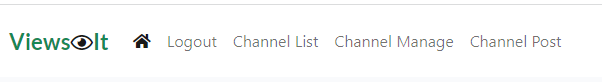

# ViewsIt Site

The ViewsIt site is a social website. There are three different type of users for the site, a super user or administrator, a visitor to the site who chooses not to create a profile on the site and a vistor to the site who creates a user profile so they can contribute to the site. A visitor to the site can view all of the posts and channels on the site. Users can create a new channel or create posts to their own channel or another users channel. Once a channel is created it has to be approved by the administrator before a post can be posted to it. A post has to be approved by the channel owner before it can be viewd by all visitors to the site.

## Multi Screen mock-up of the site

## Design of the site
### Flowchart

## Features/Functions

### Existing Features

### Navigation Bar

* The navigation bar is located at the top of all pages on the site.
* The options available dynamically change depending on the type of viewer and depending on the specific menu path chosen.

### Home button
* Shows approved posts against all channels

### Channel List page
* Lists all approved channels so the user can view approved posts again a specific channel
* Visitors to the site (Unauthenticated login) can also view the approved channel list.

### Channel Manage page
* One stop place for all channel management activity.
* Activities that can be accessed via the Channel Management page are: Request New Channel, Delete a Channel, Edit a Channel, Un-approve Posts submitted by users, Approve posts submitted by users
* Only channels created by the current logged in users are accessible on the page
* If a logged in User requests a new channel, this will be visible on their page with a status of Draft and no other user will be able to see or post to the channel. The new channel request must be approved by the site Administrator before the Channel changes to status of Approved and it will then be possible for users to create posts under this channel.
* If the Channel Manager presses the Delete Channel button a modal confirmation dialog will be displayed. Deleting a channel also removes any posts created under the channel.
* The Channel Manager (person who creates the channel) can also edit the channel detail. Doing so will put the channel back into a status of Draft requiring site Administrator approval again, which means that any posts created under the channel will be hidden from users until the channel has been re-approved.
* The Channel Manager also has the option to Un-Approve posts created by users of the channel. This will link to the Posts page interface to allow this to happen (see below). The Posts page (when called from Channel Manage page) will only display posts with a status of Approved and only from the channel selected. 
* The Channel Manager has the option also to Approve posts created by users of the channel. The link in the Channel Manager display the amount of un-approved posts in the channel as a link. This will link to the Posts page interface to allow this to happen (see below). The Posts page (when called from Channel Manage page) will only display posts with a status of Draft and only from the channel selected.

### View Posts page
* Accessible via Home button or via Channel List page
* Shows all approved posts
* Will show all approved posts from all approved channels if invoked from the Home button. Will only show approved posts from a specific channel if invoked from the Channel List page.
* Also conditionally shows unapproved posts that were created by the current logged in user. These are shaded to distinguish them from approved posts. They are also tagged with "Post not approved yet". No other users can see these posts.
* Visitors to the site (Unauthenticated login) can also view all approved posts.
* Any posts created by the current logged in user will also show an Edit button to re-edit the post, and a Delete button to delete the post. A modal confim window is presented if the user presses the Delete button. If the user re-edits a post and saves it, the Status of the post will be reset back to Draft which means that no other logged in users or visitors will be able to see the post.
* The posts page also conditionally shows two other buttons for Channel Managers, the Approve button and the Un-approve button. These are only available if the page has been called from the Channel Manage page and will not be visible to users. They will also not be visible if the owner of the Channel visits the Posts page directly, only if invoked via the Channel Manage page. Refer to Channel Manage above.
* The Posts page indicates via a solid heart icon if the Post has been 'liked' and also shows the amount of 'likes' the Post has received. 

### Create a Post
* This option is available from the menu bar at the top of the site.
* It is available to select by selecting either the Home button or by selecting a channel in the Channel List page.
* A person creating a post can enter the following information: Channel, Title of the post, Selected image to associate with the post, Main post detail, and an associated URL that will be available to click when viewing the posts in the View Posts page. Not all fields are mandatory so the user can choose to skip some if not relevant to their post.
*  Channel is only shown if selected via the Home button path, If posting from within a channel (viewing posts from the Channel List path) the channel will not be shown and will be recorded based on the channel the user currently viewing.
* Images are uploaded and stored in Cloudinary as part of the post save process.

### Post Search
* This is accessible from the menu bar
* Will search for phrase contained in either Post Tile, Post Content, or Post Author.
* Entering a username into the search field allows a user to find all of their own posts (or others).
* Results will appear in the View Posts page. Only posts matching the criteria will be displayed.

Views.py code
* Code in the Views.py carry out various validation checks throughout. For example if code to delete a channel is initiated, then a check is first made that the user is the current channel owner before proceeding with the deletion. 

### Future Features 
* The site could be extended to 

## Data Model

### Development of Data Model

When I first approached this project 

## Technology
### Language Used

* [Python](https://www.python.org) - Python is an interpreted high-level general-purpose programming language. I used Python to access the data in Google Sheets and run the game.

### Other Technologies and Libraries

* [GitPod](https://gitpod.io) - Gitpod is an online cloud based IDE. I developed and tested my project using Gitpod. I added and commited changes with messages and pushed to GitHub.
* [GitHub](https://github.com) - GitHub is a provider of Internet hosting for software development and version control using Git.
* [Heroku](https://heroku.com) - Heroku is a cloud platform as a service supporting several programming languages. I used Heroku to deploy and run the project.
* [Google Chrome Browser](https://www.google.com/intl/en_ie/chrome/) - was used to view the game.
* [Google Cloud Platform](https://cloud.google.com) - was used to set up the API's for the project.
* [Google Sheets](https://www.google.com/sheets/about/) - used to store the story flow, the story content, story prompts and the next steps for the game. 
* [Diagrams](https://wwww.diagrams.net) - used to create the flowchart for the project.
## API
Set up API to access the data in the Google Sheets

* Go to the [Google Cloud Platform](https://cloud.google.com) page.
* Click on 'Select a Project' button.
* Select 'New Project' and enter project name, 'AdventuresOfAlice' and click 'Create'
* Select project to bring you to the project page.
* Select the 'APIs & Services' option from the side menu.
* Select 'Library' to enable two APIs, Google Drive to get credentials to access the Google files and the second API will be to Google Sheets.
* In the search bar enter 'Google Drive' and select it from the list.
* Click the 'Enable' button.
* From the "Which API are you using?" choose Google Drive API.
* For the "What data will you be accessing?" select Application Data.
* For the "Are you planning to use this API with Compute Engine, Kubernetes Engine, App Engine, or Cloud Functions?" select No, I'm not using them.
* Click Next
* Enter Service Account details, 'AdventuresOfAlice' and click 'Create.
* For Role click 'Editor' and click 'Continue'.
* On the next page click on the Service Account that was created.
* On the next page click on 'KEYS' tab.
* Click on 'Add' key and 'Create New Key'
* Select 'JSON' and click 'Create'
* To select the Google Sheets API, go back to the 'Library' and search for 'Google Sheets'.
* Select 'Google Sheets API' and click 'Enable'.

## CREDS.JSON

* Copy the credentials file created into my gitpod repository and rename it to 'creds.json'
* Ensure the 'creds.json' file is added to the 'gitigore' file as it should not be pushed to GitHub.
* Take a copy the email address generated from the creds.json file.
* In the Google Sheets click 'Share' button and paste in the email address.
* Select 'Editor' and untick 'Notify People, then click 'Share'.

## Testing
### Manual Testing
* Ensure that API is working and that my code is able to access the data in the google sheets. I initially tested this by putting two rows of data in the google sheet and printing the data to screen.
* Test the validation of a player name entered. If the player name is not entered, an error message should appear and the user will be prompted for a name again.
* Test validation against the reponses in the data model. If a response is entered by the player other than the responses in the google sheet an error message should display and the player is prompted again with the same question.
* Test that the correct story content and prompt is appearing for the current step of the game.
* Make sure that the correct value in the next step is moved into the current step when the player has entered a valid response for that step.
* If there is data in the output column ensure that the correct output content is printing.
* If the next step is a 'Win' or 'Lose' step make sure that the correct ouptut is printed to the screen. Also test that the correct accummulated tallies of wins and losses are printed.
* Ensure that the player is promted to play again if the next step is 'Win' or 'Lose'.
* If the data in the data structure is not setup properly, ensure that an informative error message should appear with the current step of the game printed on screen.
* Test that the flow of the story makes sense, that for each step the next step is a valid, realistic move.
* Used the Google Sheets data as a checklist to test that all of the next steps and outputs were correct and the flow of the game was correct.

### Validator Testing

PEP8 online check
http://pep8online.com

* No errors were found in the code 

## Bug Fixes

* 

## Deployment

The application uses Heroku for deployement

### Create the application
1. Create the requirements file the Heroku will use to import the dependencies required for deployment: type pip3 freeze > requirements.txt. 

2. Navigate to the [Heroku](https://heroku.com) website
3. Create an account by entering your email address and a password
4. Activate the account through the authentication email sent to your email account
5. Click the new button and select create a new app from the dropdown menu
6. Enter a name for the application which must be unique, in this case the app name is adventures-of-alice
7. Select a region, in this case Europe
8. Click create app
## Heroku settings
1. From the horizontal menu bar select 'Settings'.
2. In the buildpacks section, where further necessary dependencies are installed, click 'add buildpack'. Select 'Python' first and click 'save changes'. Next click 'node.js' and then click 'save changes' again. The 'Python' buildpack must be above the 'node.js' buildpack'. They can be clicked on and dragged to change the order if necessary.
### Deployment
1. In the top menu bar select 'Deploy'.
2. In the 'Deployment method' section select 'Github' and click the connect to Github button to confirm.
3. In the 'search' box enter the Github repository name for the project. Click search and then click connect to link the heroku app with the Github repository. The box will confirm that heroku is connected to the repository which in this case is [Adventures of Alice](https://github.com/catrionamcd/adventures-of-alice).
4. Scroll down to select either automatic or manual deployment. For this project automatic deployment was selected. If you wish to select automatic deployment select the button 'Enable Automatic Deploys'. This will rebuild the app every time a change is pushed to Github. If you wish to manually deploy click the button 'Deploy Branch'. The default 'Master' option in the dropdown menu should be selected in both cases.
5. When the app is deployed a message 'Your app was successfully deployed' will be shown. Click 'view' to see the deployed app in the browser. The live deployment of the project can be seen here
6. The app starts automatically and can be restarted by pressing the 'Run Program' button.

## Forking the Repository
If you wish to fork the repository to make changes without affecting the original you can fork the repository

1. Navigate to the [Adventures of Alice](https://github.com/catrionamcd/adventures-of-alice) repository
2. Click the 'Fork' button at the top right of the page.
3. A forked copy of the repository will appear in your Repositories page.
## Cloning the Repository
1. On [GitHub](https://github.com) navigate to the main page of the  [Adventures of Alice](https://github.com/catrionamcd/adventures-of-alice) repository.
2. Above the list of files click the dropdown code menu.
3. Select the https option and copy the link.
4. Open the terminal.
5. Change the current working directory to the desired destination location.
6. Type the git clone command with the copied URL: git clone https://github.com/catrionamcd/adventures-of-alice.git.
7. Press enter to create the local clone.

Press enter to create the local clone.

## Credits
### Content
* Reddit Social Network Site - https://www.reddit.com
* Facebook Social Networking Site - https://www.facebook.com 
### Code
* [w3schools] - https://www.w3schools.com
* [stackoverflow] - https://www.stackoverflow.com
* [pythontutorials] - https://www.pythontutorial.net
* [analyticsvidhya] - https://www.analyticsvidhya.com
* [geeksforgeeks] - https://www.geekforgeek.org
* [python] - https://docs.python.org

* I would like to credit

