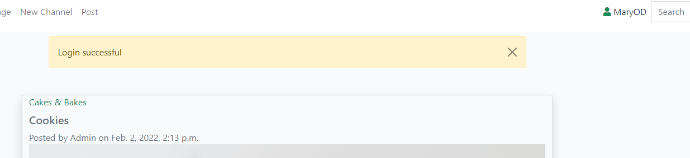

## Manual Testing

### Testing for User Stories
*User Stories*
* Site visitor to view list of approved channels.
* Site visitor to view posts in channels.
* Site visitor to view stats for a post, see how many likes there are.

1. Check that once the site is initiated a list of approved posts should appear on the screen for the vistors perusal.
2. The navigation bar should only have the home, register/login, channel list and search options.
3. The functionality to create a channel, a post or a like should not be available to an unauthenticated vistor to the site.

4. If a url link exists on a post, the vistor should be able click on this link and the clicked link should open in a separate tab.

5. Check that the number of likes is visible to the visitor.

*Pass/Fail:* **Pass**

*User Story*
* Site visitor to use search for author, channel topic or post title.
1. Enter an author to search for posts made by this author. I entered 'DavyH' in the search field for this test.

2. Enter a channel topic in search field to search for posts with the topic. I entered 'Music' in the search field for this test.

3. Enter a word to search for posts with this in the post title or description. I entered 'Surf' in the search field for this test.

*Pass/Fail:* **Pass**

*User Story*
* Account Registration for site vistor.
1. If a user wants to contribute to the site and posts some of their views or even set up their own channel of interest they must register with the site. To test this I created a new user, 'MaryOD'.

2. Test both passwords entered are the same.

2. Checked to see if the user was set up and that a successful message appears.

3. Try login as the user.

4. Enter invalid data to ensure only valid users can login.
5. Test logging out or choosing to stay logged in and going back to site.

*Pass/Fail:* **Pass**

*User Story*
* Set up a new channel as a registered user of the site.
*User Story*
* As a super user/administrator add, edit and delete posts.
*User Story*
* As a registered user of the site add, edit and delete posts.
*User Story*
* As an owner of a channel the ability to approve channel posts.
*User Story*
* As a user to like/unlike posts and comments.
*User Story*
* As a super user/administrator the ability to approve a new channel.
*User Story*
* Add an image to channel posts.
*User Story*
* Add a url within a channel posts.

* Create Channel
* Approve Channel
* Create Posts
* Edit Channel/posts
* Delete Channel/post
* Numerous searches

### Validator Testing

## CSS
[W3C CSS Validator](https://jigsaw.w3.org/css-validator/validator)

## HTML
[Nu Html Checker Validator](https://validator.w3.org/)

## Javascript
[JShint](https://jshint.com/)
There is some Javascript code within the base.html file. The code was taken from the Code Institute for the message timeout function and MdBootstrap,
https://mdbootstrap.com/docs/standard/extended/back-to-top/ for the back to the top bottom at the end of the screen.

## Python
* Admin.py

* Apps.py

* Forms.py

* Models.py

* Urls.

* Views.py

