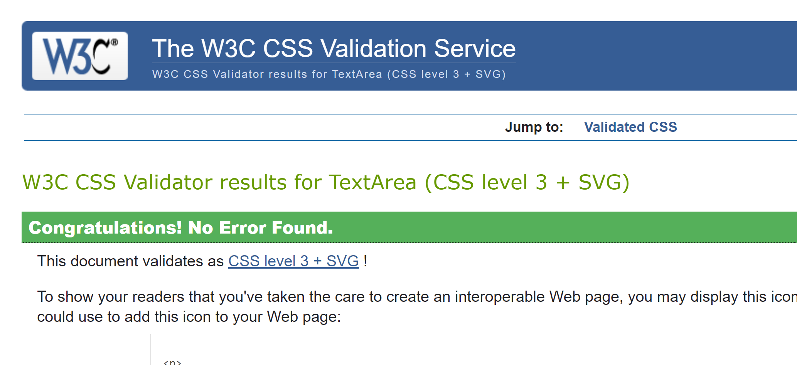
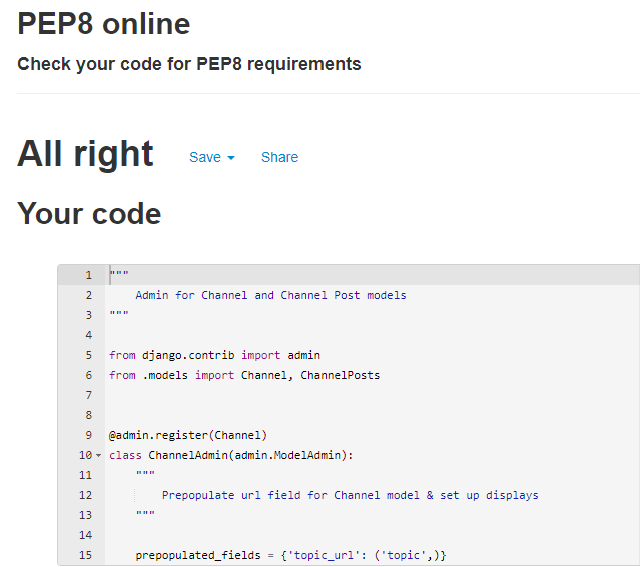
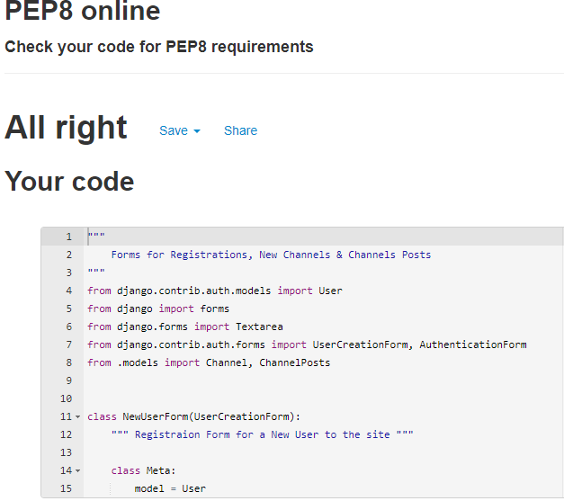

### Validator Testing

## CSS
[W3C CSS Validator](https://jigsaw.w3.org/css-validator/validator)

## HTML
[Nu Html Checker Validator](https://validator.w3.org/)

## Javascript
[JShint](https://jshint.com/)
There is some Javascript code within the base.html file. The code was taken from the Code Institute for the message timeout function and MdBootstrap,
https://mdbootstrap.com/docs/standard/extended/back-to-top/ for the back to the top bottom at the end of the screen.

## Python
* Admin.py

* Apps.py

* Forms.py

* Models.py

* Urls.

* Views.py

